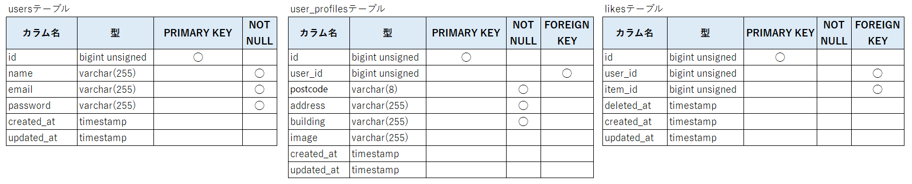
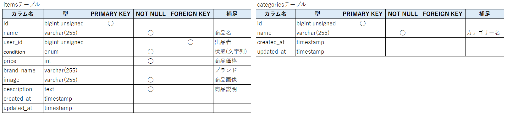
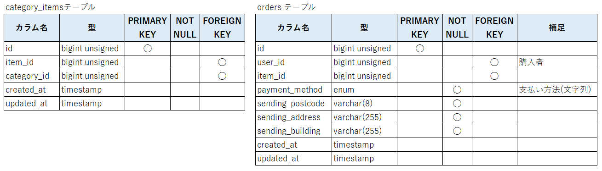
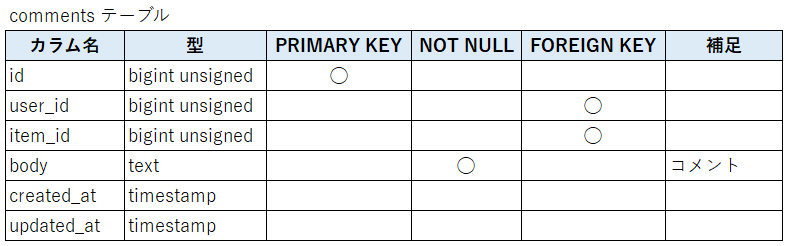
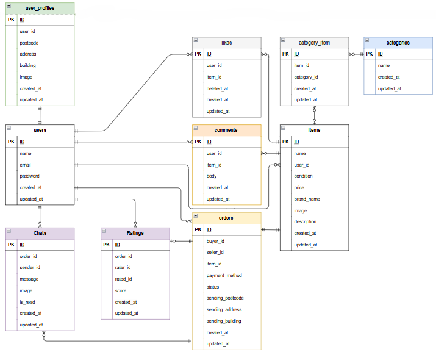

# flea-market-app

## 環境構築
**Dockerビルド**
1. `git clone git@github.com:tommy311111/flea-market-app.git`
2. DockerDesktopアプリを立ち上げる
3. `docker-compose up -d --build`

**Laravel環境構築**
1. `docker-compose exec php bash`
2. `composer install`
3. 「.env.example」ファイルを 「.env」ファイルに命名を変更。または、新しく.envファイルを作成
4. .envに以下の環境変数を追加
``` text
DB_CONNECTION=mysql
DB_HOST=mysql
DB_PORT=3306
DB_DATABASE=laravel_db
DB_USERNAME=laravel_user
DB_PASSWORD=laravel_pass
```
5. アプリケーションキーの作成
``` bash
php artisan key:generate
```

6. マイグレーションの実行
``` bash
php artisan migrate
```

7. シーディングの実行
``` bash
php artisan db:seed
```

## テストユーザー情報（初期データ）

開発環境またはテスト環境でログイン確認するためのテストユーザーがあらかじめ用意されています。
| 名前    | メールアドレス                                           | パスワード    | 出品         | 購入 | コメント | いいね | 役割               |
| ----- | ------------------------------------------------- | -------- | ---------- | -- | ---- | --- | ---------------- |
| 佐藤 美咲 | [misaki@example.com](mailto:misaki@example.com)   | password | 6件（未販売）    | なし | 0件   | 0件  | 出品のみを行う出品専用ユーザー  |
| 鈴木 大輔 | [daisuke@example.com](mailto:daisuke@example.com) | password | 1件（売却）     | 1件 | 0件   | 0件  | 出品と購入を1回ずつ経験済み   |
| 高橋 結衣 | [yui@example.com](mailto:yui@example.com)         | password | 3件（うち2つ売却） | -  | 7件   | 7件  | アクティブなコメント＆いいね担当 |
| 田中 直人 | [naoto@example.com](mailto:naoto@example.com)     | password | 0件         | 2件 | 5件   | 6件  | 購入＋コメント／いいね担当    |
| 伊藤 紗季 | [saki@example.com](mailto:saki@example.com)       | password | 0件         | 0件 | 2件   | 4件  | 閲覧ユーザー（軽めのアクション） |

> セキュリティ上、本番環境には **このテストユーザーを残さないようにしてください**。

## テスト実行方法

以下のコマンドで、Featureテストを実行できます。

```bash
docker-compose exec php bash
php artisan test --env=testing
```

## メール認証とMailtrap設定

本アプリでは、会員登録後にメール認証を行います。開発環境では [Mailtrap](https://mailtrap.io/) を使用して、送信メールの確認を行います。

### Mailtrapの使用方法

1. [Mailtrap](https://mailtrap.io/) にサインアップ（無料プランで可）
2. ダッシュボードから Inbox を作成
3. 「SMTP Settings」→ 「Laravel」を選び、以下を `.env` に追加または変更

```env
MAIL_MAILER=smtp
MAIL_HOST=sandbox.smtp.mailtrap.io
MAIL_PORT=2525
MAIL_USERNAME=あなたのMailtrapユーザー名
MAIL_PASSWORD=あなたのMailtrapパスワード
MAIL_ENCRYPTION=null
MAIL_FROM_ADDRESS=noreply@example.com
MAIL_FROM_NAME="Flea Market App"


## 使用技術(実行環境)
- PHP7.4.9
- Laravel8.83.3
- MySQL8.0.26

## テーブル設計





## ER図


## 主な画面構成（詳細は別添のExcelを参照）

- 商品一覧（トップページ）
- 商品詳細
- 会員登録／ログイン
- メール認証
- 商品出品
- プロフィール
- プロフィール編集
- 商品購入
- 送付先住所変更
（全10画面）

## URL
- 開発環境：http://localhost
- phpMyAdmin:：http://localhost:8080/
